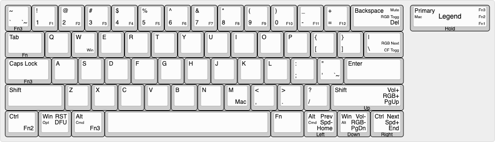

# RK61 SANDBOX

Experimental VIAL configuration and improved keymap

Layer 0 - Windows 
Layer 1 - Windows navigation/function keys 
Layer 2 - Windows backlight control 
Layer 3 - Windows media control 
Layer 4 - Mac 
Layer 5 - Mac navigation/function keys 
Layer 6 - Mac backlight control 
Layer 7 - Mac media control 

## Color Function Layers

When CF Toggle is active, then the available function keys on any layer will be visible when the function key is held.
